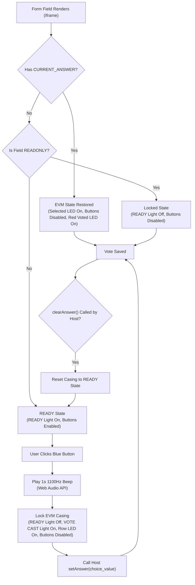
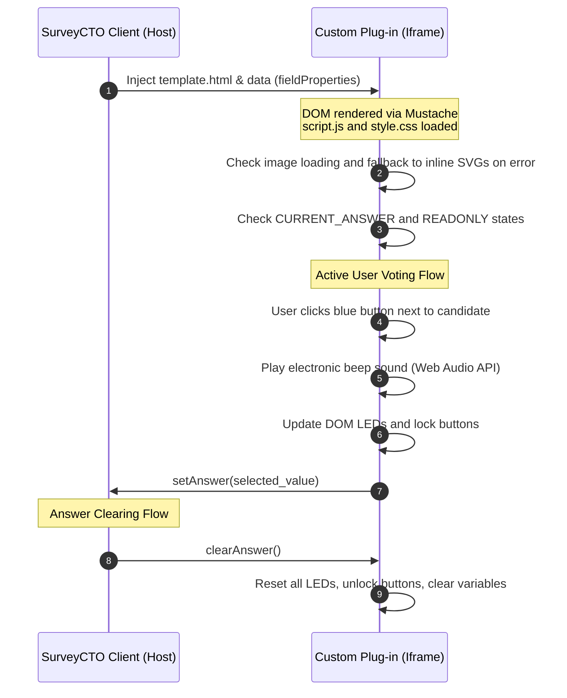

<div align="center">

  <a href="https://shobhit.net/"></a> <a href="https://x.com/Shobhit"></a> <a href="https://linkedin.com/in/geeklord/"></a> <a href="https://github.com/GeekLord/"></a> <a href="https://g.dev/Shobhit"></a>

     

</div>

# SurveyCTO Voting Form & Custom EVM Field Plug-in Project

This repository contains the design, configurations, and custom assets for a SurveyCTO data collection form that registers voter details and includes an interactive **Electronic Voting Machine (EVM)** field plug-in.

---

## Project Structure

```
Voting_Form/
├── README.md                 # Project documentation, architectures, and deployment guide
├── form.txt                  # Original user requirements scratchpad
├── voting_form.xlsx          # SurveyCTO XLSForm definition sheet (XLSX)
├── evm_vote.fieldplugin.zip  # Packaged Custom Field Plug-in zip bundle
├── bjp.png                   # Generated BJP lotus symbol (saffron background)
├── inc.png                   # Generated INC hand symbol (white background)
├── aap.png                   # Generated AAP broom symbol (white background)
├── tmc.png                   # Generated TMC twin flowers symbol (white background)
├── bsp.png                   # Generated BSP elephant symbol (blue background)
├── cpim.png                  # Generated CPI(M) hammer, sickle, and star (red background)
├── nota.png                  # Generated NOTA cross symbol (white background)
└── evm_vote/                 # Source files for the custom field plug-in
    ├── manifest.json         # Plug-in metadata & capabilities mapping
    ├── template.html         # Mustache-templated HTML structure
    ├── style.css             # EVM casing styles, LEDs, layout grid, and active classes
    └── script.js             # Beep audio generator, event wiring, and fallback SVG renderer
```

---

## XLSForm Structure (`voting_form.xlsx`)

The form defines 11 key survey fields containing conditional constraints and cascading select filters:

### Survey Fields (`survey` sheet)

| Field Name | Type | Label | Logical Rules & Constraints | Appearance / Filter |
|---|---|---|---|---|
| `name` | `text` | Respondent Name | Required. | |
| `village_name` | `text` | Village Name | Required. | |
| `age` | `integer` | Age | Required. Constraint: `. >= 18 and . <= 120`<br/>Constraint Message: *Respondent must be 18 years or older (up to 120).* | |
| `state` | `select_one state_list` | State | Required. Choices: Delhi, Maharashtra, Uttar Pradesh. | |
| `district` | `select_one district_list` | District | Required. Dynamically filtered by `state`. | `choice_filter: filter = ${state}` |
| `constituency` | `select_one constituency_list` | Constituency | Required. Dynamically filtered by `district`. | `choice_filter: filter = ${district}` |
| `gender` | `select_one gender_list` | Gender | Required. | |
| `religion` | `select_one religion_list` | Religion | Required. | |
| `party_vote` | `select_one party_list` | Cast Your Vote (EVM) | Required. Uses the custom EVM field plug-in. | `appearance: custom-evm_vote` |
| `remarks` | `text` | Respondent Remarks | Optional. | |
| `location` | `geopoint` | GPS Location | Required. | |

### Choice Cascades (`choices` sheet)
The form implements a clean hierarchical cascade for locations:
* **State** (`state_list`): Delhi (`DL`), Maharashtra (`MH`), Uttar Pradesh (`UP`).
* **District** (`district_list`):
  * Delhi (`DL`) ➔ New Delhi (`ND`), South Delhi (`SD`)
  * Maharashtra (`MH`) ➔ Mumbai City (`MC`), Pune (`PN`)
  * Uttar Pradesh (`UP`) ➔ Lucknow (`LK`), Varanasi (`VN`)
* **Constituency** (`constituency_list`):
  * New Delhi (`ND`) ➔ New Delhi (`ND_C`), Karol Bagh (`KB_C`)
  * South Delhi (`SD`) ➔ South Delhi (`SD_C`), Kalkaji (`KJ_C`)
  * Mumbai City (`MC`) ➔ Mumbai South (`MS_C`), Mumbai South Central (`MSC_C`)
  * Pune (`PN`) ➔ Pune (`PUN_C`), Baramati (`BAR_C`)
  * Lucknow (`LK`) ➔ Lucknow (`LKO_C`), Mohanlalganj (`MLG_C`)
  * Varanasi (`VN`) ➔ Varanasi (`VAR_C`), Chandauli (`CHA_C`)

---

## Custom EVM Field Plug-in Architecture

The plug-in builds a high-fidelity virtual balloting unit with realistic physical aesthetics and tactile hardware behavior.

### 1. File Details
* **`manifest.json`**: Registers the plug-in as `evm_vote`, marking it compatible with `select_one` fields.
* **`template.html`**: Iterates through the list of political party choices (`party_list`) dynamically via Mustache template tags. Renders the EVM status bar, ready LED, and ballot rows.
* **`style.css`**: Defines a realistic 3D casing using box shadows, border radius, and metallic grey/slate gradients. Includes active styling for glow states on LEDs and presses on the blue buttons.
* **`script.js`**: Controls voting, audio, fallbacks, and locks.

### 2. Physical Emulation Mechanics
* **Green READY Light**: Lights up when the form page loads, indicating the voter can interact with the machine.
* **Blue Tactile Buttons**: Style elements representing physical plastic switches. A hover state raises the highlight, and clicking pushes the element down by 2px (using CSS translates) and sets an active shadow.
* **Realistic Sound Beep**: Casts the vote by generating an electronic 1100Hz sine beep sound on-the-fly via the HTML5 **Web Audio API** (lasting 0.95 seconds). It requires no external audio attachments.
* **Red LEDs & Locking**: Once a vote button is pressed, the READY LED turns off, the red VOTE CAST status light turns on, the individual candidate row's LED glows bright red, and the ballot casing is locked (all buttons disabled).
* **Double-Layer Symbol Loading**:
  1. The template attempts to load standard raster PNG symbol attachments (`bjp.png`, `inc.png`, etc.).
  2. If the user did not upload the PNG attachments to the form, the browser triggers an `error` event. The script automatically replaces the broken images with crisp, scalable vector SVG paths loaded inline. This guarantees the plug-in remains 100% functional and visually complete out of the box.

---

## EVM Custom Field Plug-in Documentation

This custom field plug-in delegates rendering of a `select_one` field to a virtual Electronic Voting Machine (EVM) balloting unit.

### 1. Supported Field Types
* **`select_one`**: Must be attached to a `select_one` field. The plug-in iterates over the choice list and displays each choice as a separate ballot row.

### 2. Custom Parameters / Options
You can configure and customize the plug-in's labels, titles, and sound effects using parameters in the `appearance` column of the `survey` sheet:

| Parameter | Type | Default Value | Description | Example |
|---|---|---|---|---|
| `beep_frequency` | `decimal` | `1100` | The frequency of the electronic beep sound in Hertz (Hz). | `beep_frequency=1100` |
| `beep_duration` | `decimal` | `0.95` | The duration of the electronic beep sound in seconds. | `beep_duration=0.95` |
| `title` | `string` | `'ELECTRONIC VOTING MACHINE'` | The header brand text displayed on the top-left status bar of the EVM. | `title='BALLOT BOX UNIT'` |
| `ready_label` | `string` | `'READY'` | Text displayed under the green READY light. | `ready_label='READY TO VOTE'` |
| `vote_cast_label` | `string` | `'VOTE CAST'` | Text displayed under the red VOTE CAST light. | `vote_cast_label='VOTED'` |

#### Example XLSForm Appearance Configurations:
* **Standard EVM**: `custom-evm_vote`
* **Custom beep & title**: `custom-evm_vote(beep_frequency=950, beep_duration=1.2, title='CONSTITUENCY BALLOT')`
* **Translated labels**: `custom-evm_vote(ready_label='TAYYAR', vote_cast_label='MAT DAAN KIYA')`

### 3. Returned Data Value
* **`select_one` value**: The plug-in calls `setAnswer(selected_value)` with the exact `value` of the chosen option from the `choices` sheet (e.g. `'bjp'`, `'inc'`, `'nota'`).

### 4. Interface State Management
* **State Restoration**: If the user saves the form and returns to it later, the plug-in detects `fieldProperties.CURRENT_ANSWER` on load. It automatically lights up the chosen candidate's LED, sets the VOTE CAST indicator, and locks the buttons so the vote cannot be cast twice.
* **Clearing Responses**: If other form logic triggers a reset or the user manually clears the response, `clearAnswer()` is invoked. The plug-in unlocks the blue buttons, turns off the candidate's LED, turns off the red VOTE CAST light, and resets the green READY light.
* **Read-Only Support**: If the field has `read only` set to `yes` in the XLSForm, the plug-in disables all buttons and prevents interaction, displaying the casing in a locked state.

---

## Technical Lifecycles & Flows

### Plug-in Load and Event Loop

The diagram below details how the plug-in loads, checks states, registers votes, and handles clear triggers from the SurveyCTO host:



### Host-Plugin Communication Sequence

This sequence diagram displays the message exchanges between the SurveyCTO host engine and the plug-in iframe:



---

## Deployment Instructions

To deploy this form and plug-in to your SurveyCTO server:

### Step 1: Upload the XLSForm
1. Log in to your SurveyCTO Server Console.
2. Go to the **Design** tab.
3. Scroll to the **Form definitions and files** section.
4. Click **Upload form template**.
5. Choose the [voting_form.xlsx](file:///h:/Desktop/Voting_Form/voting_form.xlsx) file.

### Step 2: Attach the Custom Field Plug-in
1. In the upload wizard (or in the form designer's *Attachments* section), upload the packaged [evm_vote.fieldplugin.zip](file:///h:/Desktop/Voting_Form/evm_vote.fieldplugin.zip) file.
2. Ensure the attachment filename is exactly `evm_vote.fieldplugin.zip` so that the `appearance` value `custom-evm_vote` matches correctly.

### Step 3: Attach Party Symbols (Optional)
1. You can attach the 7 generated party symbol PNG files (`bjp.png`, `inc.png`, `aap.png`, `tmc.png`, `bsp.png`, `cpim.png`, `nota.png`) as standard media attachments to the form.
2. **If you skip attaching these images, the plug-in will automatically render the built-in inline vector SVGs.**

### Step 4: Publish & Test
1. Click **Deploy** to publish the form.
2. Open the form on **SurveyCTO Collect for Android**, **iOS**, or a **Web Form** link. Ensure device volume is turned up to hear the electronic voting beep!

---

## Reference Links & API Documentation

* **SurveyCTO General Docs**: [Designing forms: core concepts](https://docs.surveycto.com/02-designing-forms/01-core-concepts/)
* **SurveyCTO Expressions Guide**: [Using expressions in your forms](https://docs.surveycto.com/02-designing-forms/01-core-concepts/09.expressions.html)
* **SurveyCTO Choice Filters**: [Dynamically filtering lists of multiple-choice options](https://docs.surveycto.com/02-designing-forms/03-advanced-topics/02.cascading-selects.html)
* **Field Plug-in Developer Docs**: [Upstream API Reference (GitHub)](https://github.com/surveycto/field-plug-in-resources/blob/master/docs/api-reference.md)
* **SurveyCTO Field Plug-in Console Guide**: [Testing field plug-ins](https://docs.surveycto.com/02-designing-forms/03-advanced-topics/07.testing-field-plug-ins.html)
